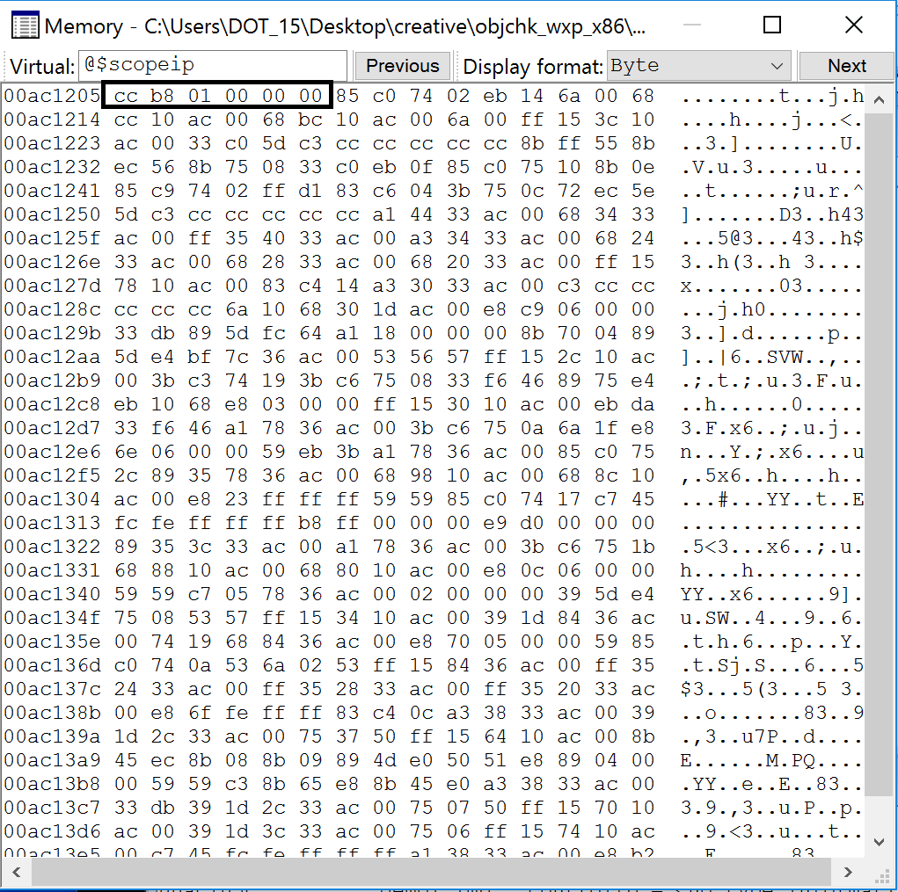
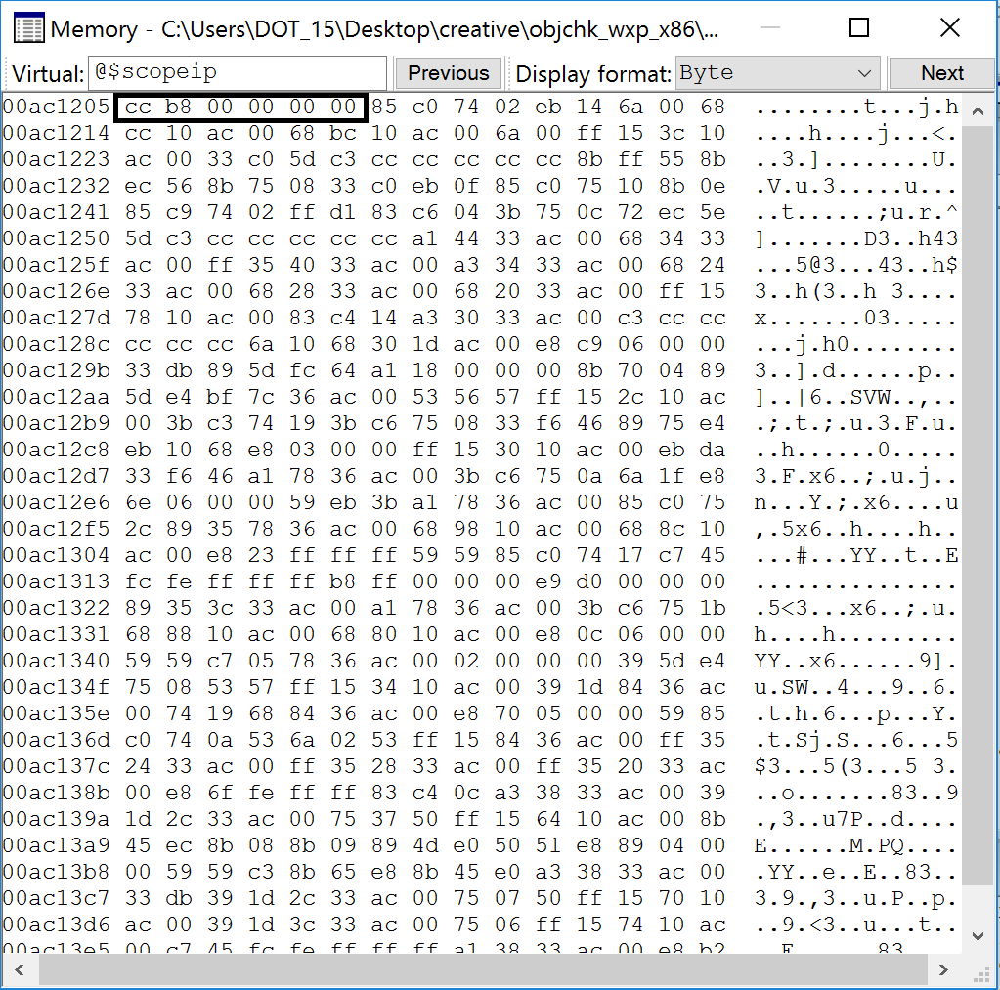

:title: Introduction to Reverse Engineering
:data-transition-duration: 1500
:css: asm.css

An Introduction to Reverse Engineering

----

Intro to Reverse Engineering
============================

.. code:: 

	0:000> da 00d010d8
	00d010d8 "Instructor | email"
	0:000> da 00d014a0
	00d011a "Aaron Bray | aaron.m.bray@gmail.com"

----

Course Roadmap
==============

.. code::

	0:000> dt demo!_COURSE_ROADMAP
   		+0x000 Introduction     : Uint4B
   		+0x004 IntroDynamicAnalysis : Uint4B
   		+0x008 IntroStaticAnalysis : Uint2B
   		+0x00a IntroToCompilers : Uint2B
   		+0x00c WindowsInternalsPrimer : UChar
   		+0x00d DynamicRuntimeLinking : UChar
   		+0x00e ExecutableFileFormats : UChar
   		+0x00f LinkingAndLoading : UChar
   		+0x010 BinaryAnalysisConcepts : Uint4B
   		+0x014 CompilerOptimizations : Uint4B
   		+0x018 CPlusPlus        : Uint4B
   		+0x01c AdditionalTopics : Uint4B

----

Introduction
============

Beginning RE

----

Objectives
==========

* Understand the basic goals of RE
* Introduce various types of analysis
* Identify translation of basic constructs from C to Assembly

----

Reverse Engineering
===================

* Process of determining how a program (or set of programs) works (typically without access to source code)
* Wide variety of motivations

----

Types of Analysis
=================

* Dynamic Analysis
	+ Focus on watching what happens at run time
	+ Debuggers and whole-system monitoring tools (such as procmon/procexplorer) may be utilized
* Static Analysis
	+ Focus on looking at disassembly, file sections and headers, etc
	+ Tools such as IDA Pro, radare2, and CFF Explorer, or python libraries such as pefile or elftools may be employed
	+ Other tools such as strings are also frequently used
* Combination
	+ May use both static and dynamic analysis to get results

----

Intro Dynamic Analysis
======================

----

Objectives
==========

* Understand and utilize, at a basic level, principles relating to dynamic analysis
* Understand the basic operation of debuggers
* Utilize, at a basic level, Windbg for the purpose of dynamic analysis
* Utilize, at a basic level, the Sysinternals tools for the purpose of dynamic analysis

----

Dynamic Analysis Tools
======================

* \*mon tools (sysinternals) - Rather powerful instrumenting tools that give a good view of resource usage
* Debuggers - Allow us to inspect and trace through the execution of a given application
* (Linux) strace - Gives a list of system calls used by a given application

----

Procmon
=======

* Can give lots of good information about process accesses
* Lots of filter options that can be leveraged
* Provides a good amount of insight into application I/O activity

----

Process Explorer
================

* Gives a great deal of useful information about what system resources a given process is interacting with
* Can view lots of good details regarding kernel objects accessed
* We will discuss this in greater detail later

----

Debuggers, How do they work, anyhow?
====================================

Basic Workflow:

* Open process
* Read/Modify memory
* Read/Modify register state

----

Breakpoints
===========

Two Varieties: Hardware and Software

* Hardware - Utilizes Debug Registers
	+ Limited in number (DR0-3 on x86)
	+ Each register holds a linear address
	+ DR7 (the control register) dictates the condition to break on (read/write/execute)
	+ On some platforms (e.g., Linux), they require running in kernel mode to set/modify

* Software - the int3 (0xCC) instruction

----

Windbg
======

* The debugger we'll focus on in this course
* Doubles as both a user and kernel mode debugger
* Somewhat steep learning curve, but very aware of Windows internal state
* Lots of extremely useful extensions built-in

----

Windbg Displays
===============

* All available via the "View" menu
* All act as snap-ins for the Windbg console
* Many times commands exist to display the same information
* Workspace can be saved/loaded between debugging sessions

----

Windbg View List
================

* Command - Interactive Command Prompt
* Watch - Watch window for manually specified/defined variables (castable to other types)
* Locals - Local variables visible in the current scope
* Registers - Editable register display
* Memory - An editable memory view; can display in a variety of formats (defaults to hex bytes)
* Call Stack - Displays the call stack relative to the current location
* Disassembly - Disassembly Window

----

Windbg - Breakpoints
====================

* Hardware: ba [Access: r|e|w] [Size: 1|2|4] <address>
* Software: bp <address/location>

* Listing: bl
* Disable: bd
* Enable: be
* Clearing: bc <breakpoint number>

----

Symbols and Debugging
=====================

* What are debugging symbols?
	+ Symbolic information normally discarded during the compilation process
	+ Typically used to aid in debugging
	+ Microsoft provides stripped-down symbols for _most_ windows binaries
	+ Many otherwise-undocumented structures are exposed this way
* PDB - Documentation available via github: https://github.com/Microsoft/microsoft-pdb
* DWARF - http://dwarfstd.org

----

Symbols and Modules
===================

* Handout on symbol configuration and issues
* Looking at Modules in a Process
	+ (windbg) lm 	- Lists the loaded modules (executable files) in a process
	+ (windbg) x <module>!<pattern> 	- Lists symbols exported by <module> that match <pattern>

----

:class: windbg

Example: Examining Exported Symbols
===================================

.. code::

	0:000> lm
	start    end        module name
	006a0000 006a5000   demo       (deferred)             
	744c0000 7463e000   KERNELBASE   (deferred)             
	74730000 74810000   KERNEL32   (deferred)             
	77090000 7714e000   msvcrt     (deferred)             
	771f0000 7736b000   ntdll      (pdb symbols) <path>
	0:000> x ntdll!ZwQuerySystem*
	77266f30          ntdll!ZwQuerySystemInformation (<no parameter info>)
	77267170          ntdll!ZwQuerySystemTime (<no parameter info>)
	77268050          ntdll!ZwQuerySystemEnvironmentValue (<no parameter info>)
	77268060          ntdll!ZwQuerySystemEnvironmentValueEx (<no parameter info>)
	77268070          ntdll!ZwQuerySystemInformationEx (<no parameter info>)

----

Displaying Data
===============

Dumping data at a location:

* (windbg) db <location> 	 - dump as bytes 
* (windbg) dw/d/q <location> - dump as WORDs/DWORDs/QWORDs
* (windbg) da <location> 	 - dump as ASCII
* (windbg) du <location> 	 - dump as Unicode

----

Searching
=========

* (windbg) s 	- Search memory

----

:class: windbg

Registers and Pointers
======================

Register information:

* (windbg) r 	- Displays the current values stored in registers

Dumping Pointer Data:

* (windbg) dp <location> 	- Dump as pointer
* (windbg) poi(<location>)	- Dereference pointer

Examining a pointer in a register:

.. code::

	0:000> r
	eax=00d610bc ebx=00000000 ecx=771049b3 edx=00000000 esi=00000001 edi=00d6367c
	eip=00d61251 esp=000cfc58 ebp=000cfc58 iopl=0         nv up ei pl nz na po nc
	cs=0023  ss=002b  ds=002b  es=002b  fs=0053  gs=002b             efl=00000202
	demo!main+0x31:
	00d61251 cc              int     3
	0:000> da @eax
	00d610bc  "abcdef"

----

:class: windbg

Disassembling
=============

* In addition to the disassembly window, Windbg has the ability to disassemble both forward and backward
	+ (windbg) u <location> 	- unassemble forward
	+ (windbg) ub <location> 	- unassemble backward
	+ (windbg) uf <location> 	- unassemble function

.. code::
	
	0:000> x ntdll!ZwQuerySystem*
	77266f30          ntdll!ZwQuerySystemInformation (<no parameter info>)
	77267170          ntdll!ZwQuerySystemTime (<no parameter info>)
	77268050          ntdll!ZwQuerySystemEnvironmentValue (<no parameter info>)
	77268060          ntdll!ZwQuerySystemEnvironmentValueEx (<no parameter info>)
	77268070          ntdll!ZwQuerySystemInformationEx (<no parameter info>)
	0:000> u 77266f30          
	ntdll!NtQuerySystemInformation:
	77266f30 b836000000  mov   eax,36h
	77266f35 bab0b52777  mov   edx,offset ntdll!Wow64SystemServiceCall (7727b5b0)
	77266f3a ffd2        call  edx
	77266f3c c21000      ret   10h
	77266f3f 90          nop
	ntdll!NtOpenSection:
	77266f40 b837000000  mov   eax,37h
	77266f45 bab0b52777  mov   edx,offset ntdll!Wow64SystemServiceCall (7727b5b0)
	77266f4a ffd2        call  edx

----

Stepping
========

Single step-in/over:

* (windbg) t 		- Trace - Single Step/step in
* (windbg) p 		- Step Over

More complex step operations:

* (windbg) tc/pc 	- Trace or Step to Call
* (windbg) tb 		- Trace to next branch (jmp or jcc)

----

Patching Memory
===============

Windbg can directly edit memory during operation

* Bytes can be overwritten in the memory view window
* Windbg can also assemble in-place (essentially replacing instructions) 
	+ (windbg) a <location>  	- Allows us to begin assembling starting at the given <location>
	+ Once you start, you can continue to assemble you hit enter on an empty line
* There is also an "edit memory" command:
	+ (windbg) e(b|d|w) <location> <value>

----

:class: windbg

Hypothetical Crackme
====================

.. code:: 

	demo!main:
	00ac1200 8bff            mov     edi,edi
	00ac1202 55              push    ebp
	00ac1203 8bec            mov     ebp,esp
	00ac1205 cc              int     3
	00ac1206 b801000000      mov     eax,1
	00ac120b 85c0            test    eax,eax
	00ac120d 7402            je      demo!main+0x11 (00ac1211)
	00ac120f eb14            jmp     demo!main+0x25 (00ac1225)
	00ac1211 6a00            push    0
	00ac1213 68cc10ac00      push    offset demo!`string' (00ac10cc)
	00ac1218 68bc10ac00      push    offset demo!`string' (00ac10bc)
	00ac121d 6a00            push    0
	00ac121f ff153c10ac00    call    dword ptr [demo!_imp__MessageBoxA (00ac103c)]
	00ac1225 33c0            xor     eax,eax
	00ac1227 5d              pop     ebp
	00ac1228 c3              ret

.. note::
	
	* Breakpoint at 00ac1205 (line 4)
	* Comparison at 00ac120b (line 6) will always fail, and the "je" will be skipped
	* The unconditional jump at 00ac120f (line 8) will take us to essentially the end of the function.
	* How can we fix this, so that the "je" path gets taken?

----

:class: windbg

Patching Some Bytes
===================

One option:

.. code::

	00ac1206 b801000000      mov     eax,1
	00ac120b 85c0            test    eax,eax
	00ac120d 7402            je      demo!main+0x11 (00ac1211)

* How can we make this case true?

----

Patching Some Bytes
===================

* If we can make eax equal to zero, the jump will get taken

We now need to make this:

.. code:: 

	00ac1206 b801000000      mov     eax,1

Look like this:

.. code::

	00ac1206 b800000000      mov     eax,0

----

Memory Window
=============

----

Memory Window (Part 2)
======================

----

:class: windbg

Result
======

.. code::

	demo!main:
	00ac1200 8bff            mov     edi,edi
	00ac1202 55              push    ebp
	00ac1203 8bec            mov     ebp,esp
	00ac1205 cc              int     3
	00ac1206 b800000000      mov     eax,0
	00ac120b 85c0            test    eax,eax
	00ac120d 7402            je      demo!main+0x11 (00ac1211)
	00ac120f eb14            jmp     demo!main+0x25 (00ac1225)
	00ac1211 6a00            push    0
	00ac1213 68cc10ac00      push    offset demo!`string' (00ac10cc)
	00ac1218 68bc10ac00      push    offset demo!`string' (00ac10bc)
	00ac121d 6a00            push    0
	00ac121f ff153c10ac00    call    dword ptr [demo!_imp__MessageBoxA (00ac103c)]
	00ac1225 33c0            xor     eax,eax
	00ac1227 5d              pop     ebp
	00ac1228 c3              ret

----

And Finally...
==============

.. image:: ./img/Sec1_success.png

----

:class: windbg

Alternatively...
================

Once we get here:

.. code::

	demo!main+0x5:
	00ac1205 cc              int     3
	0:000> u
	demo!main+0x5 [c:\users\dot_15\desktop\creative\main.c @ 9]:
	00ac1205 cc              int     3
	00ac1206 b801000000      mov     eax,1
	00ac120b 85c0            test    eax,eax
	00ac120d 7402            je      demo!main+0x11 (00ac1211)
	00ac120f eb14            jmp     demo!main+0x25 (00ac1225)
	00ac1211 6a00            push    0
	00ac1213 68cc10ac00      push    offset demo!`string' (00ac10cc)
	00ac1218 68bc10ac00      push    offset demo!`string' (00ac10bc)

----

:class: windbg

Assembling
==========

We could:

.. code::

	0:000> a 00ac1206 
	00ac1206 mov eax, 0
	mov eax, 0
	00ac120b 

Which would also yield the same result:

.. code::

   00ac1206 b800000000      mov     eax,0
   00ac120b 85c0            test    eax,eax
   00ac120d 7402            je      demo!main+0x11 (00ac1211)

\*\*\* CAUTION: Be cautious when doing this, as it can change the meaning of adjacent instructions \*\*\*

----

Problems with This Demo
=======================

* This entire demo is predicated on having symbols
* Many times, symbols will not be available
* Program's real entry point (e.g., main) will have to be located

----

How to Proceed
==============

* $exentry will give the target binary's entry point
* Getting to main will require wading through crt startup code
* Fortunately, CRT source is provided via Visual Studio
	+ Initialization steps are fairly similar
	+ mcrtexe.cpp - under "vcruntime" (VS2015)
	+ Other files exist, for other subsystems

----

Other Suggestions
=================

* Look for functions that will likely be called sometime during CRT initialization and set breakpoints
	+ Be aware of differences between XP and Windows Vista+ - some Kernel32 functions now live in KERNELBASE
	+ Good targets might be environment and command line setup (e.g., GetCommandLineA|W, GetEnviron)
* Can also look for CRT methods that may be equivalent, if those methods are not in the imports list
	+ __getmainargs
* Examining the number of args in the string (e.g., "da <arglist>" after GetCommandLineA returns) yields argc
* Tracing to next call (tc or pc), and examining args passed to function will help to locate entry point

----

Lab 1
=====

Patch2Win! 
