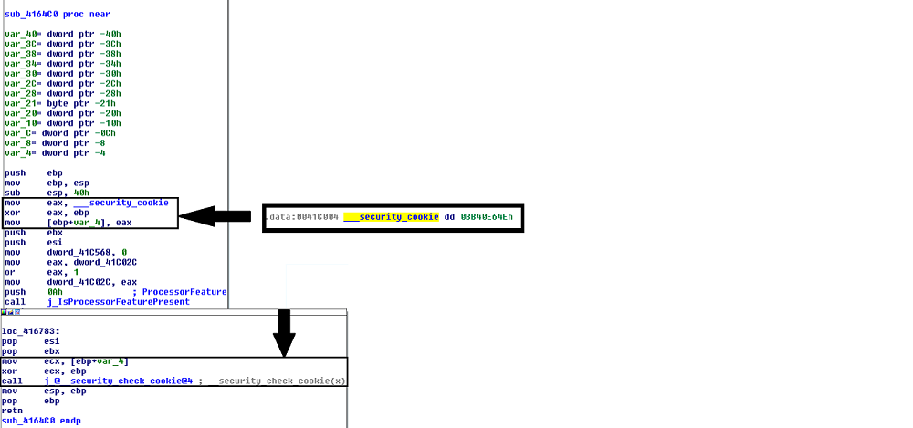

:title: Introduction to Reverse Engineering
:data-transition-duration: 1500
:css: asm.css

An Introduction to Reverse Engineering

----

Compilers - an Introduction
===========================

----

Objectives
==========

* Understand fundamental concepts pertaining to how the compilation process works
* Understand and identify security mechanisms implemented by compilers
* Understand and identify some features and minor optimizations performed by compilers
* Understand and identify intrinsic methods

----

The Compilation Process
=======================

* How do we get from a text file to a binary?

----

Lexing: The First Step
======================

* Text is broken into tokens
* The "how" is based on language contraints  (e.g., whitespace, semicolons, etc)

----

Parsing
=======

* The next step in interpreting text
* Stream of tokens created from lexing are examined here
* Abstract Syntax Tree (AST) gets built from this

----

Where too from here?
====================

* Several transformations typically applied
	+ the original AST gets changed a bit, losing context
	+ Sometimes something that resembles a pseudo-assembly gets produced here (e.g., llvm ir)
	+ Typically still has more "intent" (e.g., what the programmer intended to do) encoded than raw assembly/opcodes
* Optimizations get added here
* Register spills and variable lifecycle gets analyzed/calculated at this point

----

\... And out comes a binary?
============================

* Various sections get generated (more on this topic later)
* Compilation finishes, assembly gets produced, and assembling happens
* Object files get created
* Linking occurs

And finally....

* A binary gets created!

----

Compiler Features
=================

* A number of security features exist (and are now usually implemented by default) for compilers
* Some are specific to vendors/file formats

----

Stack Canary
============

* A "cookie" that is added to the stack inside of a function call to indicate that the stack has been corrupted
* Generally set at function prologue (on stack)
* Typically checked just prior to function return

----

Stack Canary
============

----

Relocations
===========

* PE-specific
* Provide information to fix up addresses on load (more on this topic later)
* Makes PE files (which are not position-independent) work with ASLR

----

Patch Points
============

* Microsoft originated
* GCC extension - ms_hook_prologue - will provide
* Implementation that allows for hotpatching
* Provides a 2-bytes, idempotent function prelude that can overwritten with a jmp
* Typically preceded by a 5 byte (in x86, anyhow), writable area to add a bigger jmp

----

Patch Point
===========

.. code:: nasm

	; patchable area... 5 bytes of space
	winfunc:
		mov edi, edi ; two byte reserved patch point

After patch:

.. code:: nasm
	
	patched:
		jmp newloc	; 5-byte jump to real destination
	winfunc:
		jmp	patched	; 2-byte relative jump (backward)

----

Patch Point (cont'd)
====================

Looking at disassembled bytes we'd get something like:

Before:

.. code:: objdump-nasm

	0xcc 0xcc 0xcc 0xcc 0xcc  ; the prologue
	0x89 0xff				  ; the patch point

After:

.. code:: objdump-nasm

	0xe9 0xf3 0xf9 0xff 0xff  ; the jmp newloc bytes
	0xeb 0xf9				  ; the short jmp

----

Intrinsic Functions
===================

* Intrinsic functions are special functions implemented directly by the compiler
* Intrinsic offerings vary by compiler
* They typically map directly to a small number of assembly instructions
* Typical use cases are to expose functionality provided by assembly that doesn't exist in the C (or C++) standard library, such as access to SIMD operations.

----

Intrinsic Functions (cont'd)
============================

Example (Microsoft):

.. code:: c++

	__debugbreak();

maps directly to:

.. code:: nasm

	int3

----

Intrinsic Function (cont'd)
===========================

Comprehensive lists for supported intrinsic functions should be provided as part of compiler documentation

* MSDN: https://msdn.microsoft.com/en-us/library/26td21ds.aspx
* GCC (4.2.4): http://gcc.gnu.org/onlinedocs/gcc-4.2.4/gcc/X86-Built_002din-Functions.html
* Clang: http://clang.llvm.org/docs/LanguageExtensions.html#introduction

----

Compiler-implemented Functions
==============================

* A number of common functions may be implemented directly by the compiler inline
* Methods such as strlen, memcpy, etc may fall into this category
* As such, disassembly may not contain a "call" to these methods, but rather something like:

.. code:: nasm

	mov ecx, 0x30
	mov esi, [ebp - 0x0c]
	mov edi, [ebp + 0x08]
	rep movsb

in place of memcpy

----

Lab 5
=====

----

Dynamic and Runtime Linking
===========================

----

Objectives
==========

* Understand and utilize Dynamic and Runtime loading techniques
* Understand and utilize Dynamic and Runtime linking techniques

----

What is Dynamic Linking?
========================

* Allows binary data to be distributed as a DLL or Shared Object file
	+ Has the same general attributes as a standard executable  (including the same file format)
	+ Provides common library services for multiple executables without having to increase size as much as static linking
* Typically requires a static library and a header file
* Loaded into process space at runtime, as part of dependency resolution
	+ When target executable is run, its imports are examined by the operating system
	+ Dynamic libraries it depends on are loaded prior to execution
* Most (read: nearly all) applications implicitly do this in one way or another
	+ C(++) Runtime code is often dynamically linked (e.g., glibc)
	+ Ancillary, OS-provided code (e.g., kernel32) works in this fashion also
* Loading will fail if the required dynamic library is not present

----

Runtime Linking
===============

* Similar to dynamic linking, but with a key difference
	+ No extra lib/header generally required
	+ Onus is entirely on end user (e.g., the executable) to ensure that things go smoothly when loading/linking
* Exported functions must be located by end user
	
----

Runtime Linking - How to load a library
=======================================

* Windows
	+ LoadLibrary(A|W) - Provides the interface for loading a DLL from disk into the current process
	+ GetProcAddress  - Given an HMODULE (returned by LoadLibrary or GetModuleHandle), it will attempt to locate an exported function.
* Linux
	+ dlopen - Similar in function to LoadLibrary, it will load a shared object into the current process.
	+ dlsym - As with GetProcAddress, it will attempt to locate an exported symbol on the provided library

----

Windows Exports
===============

* Can be exported either by name or ordinal
	+ Name - string; may (or may not) be mangled according to calling convention
	+ Ordinal - Simply a number - Must be WORD-sized or smaller
* Both are really just methods of finding exported symbols
* Exports can also forward to other DLLs

----

Windows - Loading a Library
===========================

.. code:: c

	int main(int argc, char** argv)
	{
		// Our module
		HMODULE hm = NULL;
		// Our dynamic function pointer
		int (__stdcall *dynamicFunction)(int) = NULL;
		int result = 0;

		// try to dynamically load our library, fail and return if we can't find it!
		if(NULL == (hm = LoadLibraryA("MyLib.dll"))) {
			printf("We failed to load our library! %d\n", GetLastError());
			return -1;
		}
		// Try to find our dynamic function... this requires us to do a crazy cast.
		// If it were exported by ordinal, the string "MyFunction@4" would change to: (char*)n,
		// where n is the ordinal number. This is a bit strange (to say the least), but the way the
		// API works.
		if(NULL == (dynamicFunction = (int(__stdcall*)(int))GetProcAddress(hm, "MyFunction@4"))) {
			printf("Failed to find MyFunction! %d\n", GetLastError());
			return -2;
		}
		// Now we call our function, and FreeLibrary (since we are done with it now)
		result = dynamicFunction(10);
		FreeLibrary(hm);

		return result;
	}

----

Linux - Loading a Library
=========================

.. code:: c

	int main(int argc, char** argv)
	{
		void* hm = NULL;
		int(*myexport)(int) = NULL;
		int result = 0;
		// As with loadlibrary, we pass the path to load
		if(NULL == (hm = dlopen("./mylib.so", RTLD_NOW))) {
			printf("Failed to find our lib! %s\n", strerror(errno));
			return errno;
		}
		// again, we get our function pointer
		if(NULL == (myexport = (int(*)(int)))dlsym(hm, "myExportedFunction")) {
			printf("Failed to find our function! %s\n", strerror(errno));
			return errno;
		}
		// call and close!
		result = myexport(10);
		dlclose(hm);

		return result;
	}

----

Lab - Runtime Linking
=====================

// TODO: Finish windows lab