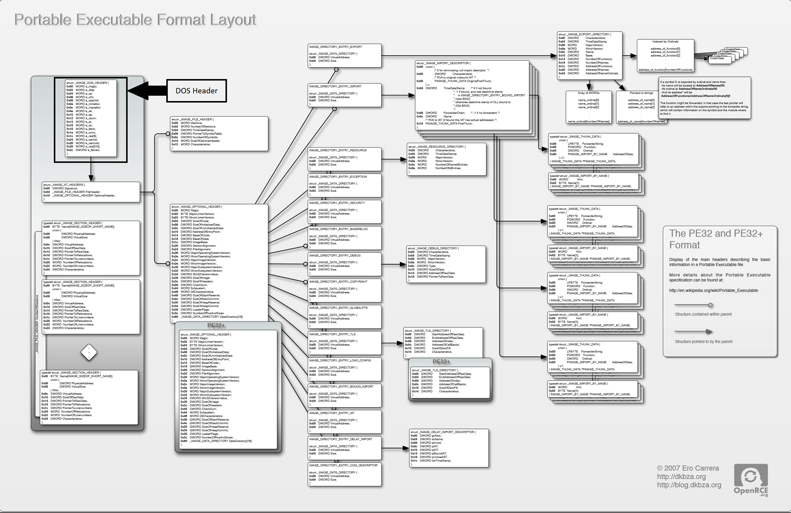
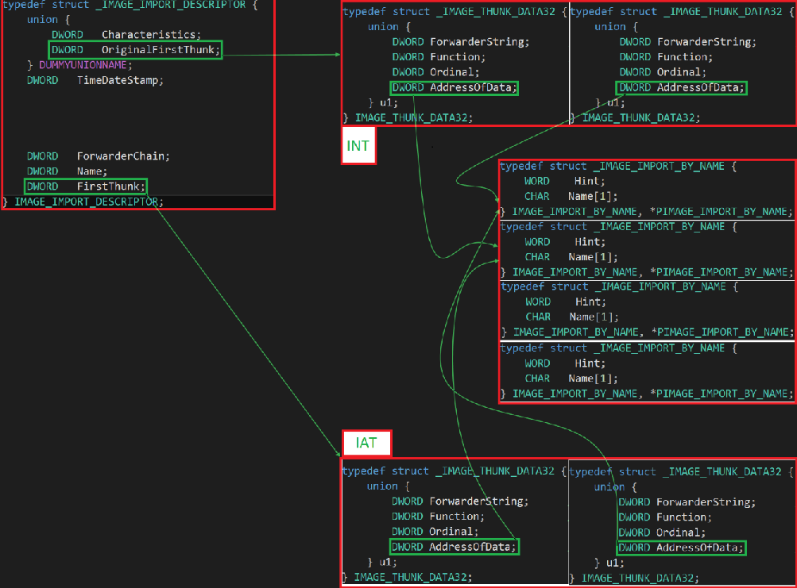
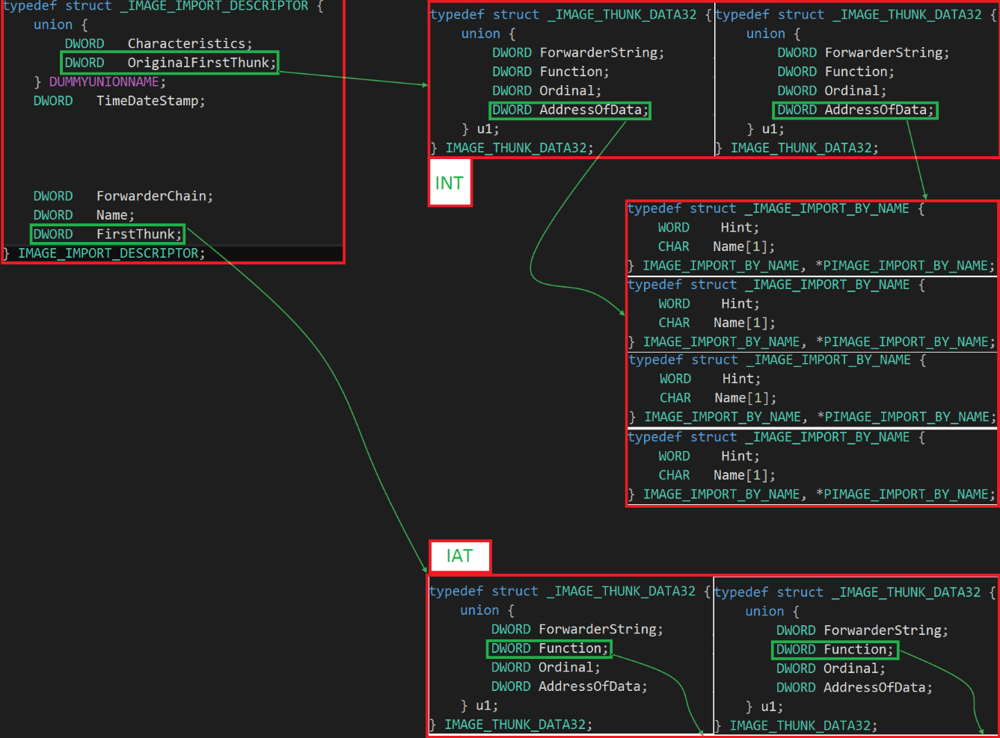
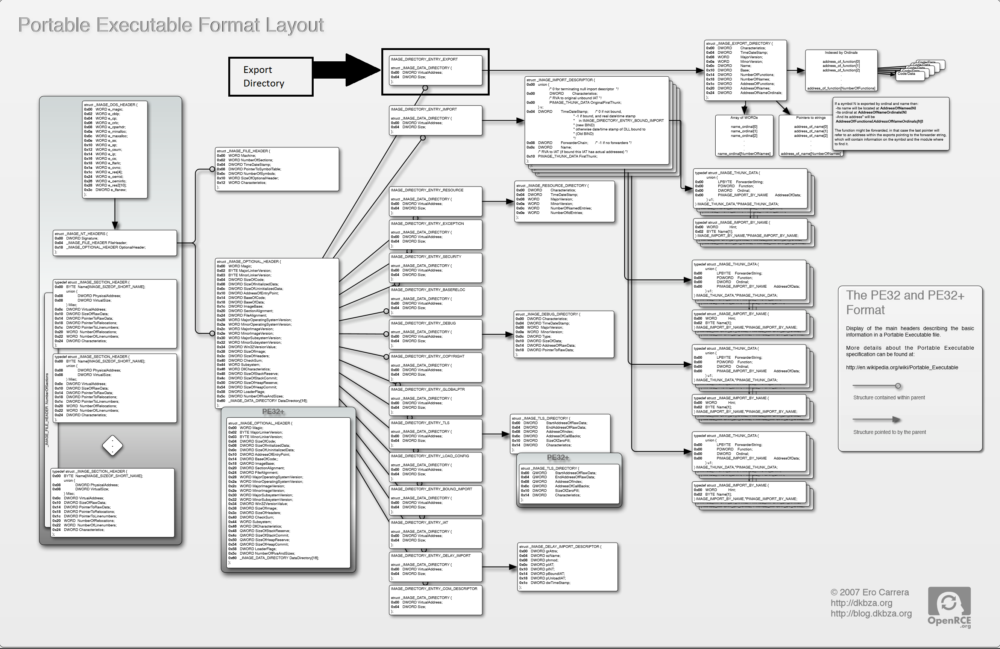

:title: Introduction to Reverse Engineering
:data-transition-duration: 1500
:css: asm.css

An Introduction to Reverse Engineering

----

Executable File Formats
=======================

----

Objectives
==========

* Understand and Identify the major components of executable file formats
	+ PE
	+ ELF
	+ MACH-O
* Analyze the composition of provided binaries

----

A Tour of PE
============

----

Portable Executables
====================

* Descended from the Common Object File Format (COFF)
* The standard executable file format used by Windows
* Can have many extensions, depending on use case. Common ones include:
	+ dll
	+ exe
	+ sys

----

PE Concepts
===========

* Consist of a variety of structures
* Data addressing within the file typically takes two forms:
	+ RVA - Relative Virtual Address - An offset into the file (from the base)
	+ VA - Virtual Address - An absolute memory address
* Lots of good resources for dealing with the file format (though it can be a bit complicated)

----

:class: mid-image

.. image:: ./img/pe101.svg

Image Credit: corkami wiki - https://code.google.com/archive/p/corkami | https://creativecommons.org/licenses/by/3.0/us/

----

:data-y: r2000

Introducing pefile
==================

* Robust Python library for parsing PE files
* Great support for reading all and updating many sections
* May allow for inspection of binaries with malformed headers that are difficult for other, more complete solutions (e.g., IDA) to handle

----

Using pefile
============

.. code:: python

	import pefile

	pe = pefile.PE("demo.exe")

----

:class: flex-image

Another View
============

.. image:: ./img/Carrera_PE_vis.png

Image Credit: Ero Carrera

----

:class: flex-image

Original Image Credit: Ero Carrera

----

:class: windbg

DOS Header
==========

.. code:: c
	
	typedef struct _IMAGE_DOS_HEADER {      // DOS .EXE header
	    WORD   e_magic;                     // Magic number
	    WORD   e_cblp;                      // Bytes on last page of file
	    WORD   e_cp;                        // Pages in file
	    WORD   e_crlc;                      // Relocations
	    WORD   e_cparhdr;                   // Size of header in paragraphs
	    WORD   e_minalloc;                  // Minimum extra paragraphs needed
	    WORD   e_maxalloc;                  // Maximum extra paragraphs needed
	    WORD   e_ss;                        // Initial (relative) SS value
	    WORD   e_sp;                        // Initial SP value
	    WORD   e_csum;                      // Checksum
	    WORD   e_ip;                        // Initial IP value
	    WORD   e_cs;                        // Initial (relative) CS value
	    WORD   e_lfarlc;                    // File address of relocation table
	    WORD   e_ovno;                      // Overlay number
	    WORD   e_res[4];                    // Reserved words
	    WORD   e_oemid;                     // OEM identifier (for e_oeminfo)
	    WORD   e_oeminfo;                   // OEM information; e_oemid specific
	    WORD   e_res2[10];                  // Reserved words
	    LONG   e_lfanew;                    // File address of new exe header
	  } IMAGE_DOS_HEADER, *PIMAGE_DOS_HEADER;

Defined: winnt.h

----

:data-x: r2000

DOS Header - Useful Fields
==========================

The most interesting fields in this header:

.. code:: c

	typedef struct _IMAGE_DOS_HEADER {  // DOS .EXE header
	    WORD   e_magic;                 // Magic Number
	    // ...
	    LONG   e_lfanew;               // The RVA to the PE header
	  } IMAGE_DOS_HEADER, *PIMAGE_DOS_HEADER;

----

Dos Header (cont'd)
===================

* e_magic:  The first two bytes of the PE files spell out "MZ", which is there for compatibility reasons
	+ Originally the "magic number" for DOS 16-bit executables
	+ An Old New Thing article talks a bit about historical aspect of this transition: https://blogs.msdn.microsoft.com/oldnewthing/20060130-00/?p=32483/ 
* e_lfanew: This is the RVA essential to getting us to the next important header (the NT header), which will get us to the rest of the binary.

----

pefile view
===========

.. code:: python

	>>> import pefile
	>>> pe = pefile.PE("demo.exe")
	>>> pe.DOS_HEADER
	<Structure: [IMAGE_DOS_HEADER] 0x0 0x0 e_magic: 0x5A4D 0x2 0x2 
	e_cblp: 0x90 0x4 0x4 e_cp: 0x3 0x6 0x6 e_crlc: 0x0 0x8 0x8 
	e_cparhdr: 0x4 0xA 0xA e_minalloc: 0x0 0xC 0xC 
	e_maxalloc: 0xFFFF 0xE 0xE e_ss: 0x0 0x10 0x10 
	e_sp: 0xB8 0x12 0x12 e_csum: 0x0 0x14 0x14 e_ip: 0x0 0x16 0x16 
	e_cs: 0x0 0x18 0x18 e_lfarlc: 0x40 0x1A 0x1A 
	e_ovno: 0x0 0x1C 0x1C e_res: 0x24 0x24 
	e_oemid: 0x0 0x26 0x26 e_oeminfo: 0x0 0x28 0x28 
	e_res2: 0x3C 0x3C 
	e_lfanew: 0xE8>
	>>> hex(pe.DOS_HEADER.e_lfanew)
	'0xe8'

----

:class: flex-image

.. image:: ./img/PE_vis_nthdr.png

Original Image Credit: Ero Carrera

----

NT Header
=========

.. code:: c

	typedef struct _IMAGE_NT_HEADERS {
	    DWORD Signature;
	    IMAGE_FILE_HEADER FileHeader;
	    IMAGE_OPTIONAL_HEADER32 OptionalHeader;
	} IMAGE_NT_HEADERS32, *PIMAGE_NT_HEADERS32;

Defined: winnt.h

----

NT Header Fields
================

* Signature spells out "PE, 0, 0" 0x00 0x00 0x45 0x50 (little endian)
* File header (discussed more next slide)
* OptionalHeader - Not really that optional!

----

NT Header pefile View
=====================

.. code:: python

	>>> pe.NT_HEADERS
	<Structure: [IMAGE_NT_HEADERS] 0xE8 0x0 Signature: 0x4550>

----

:class: flex-image

.. image:: ./img/PE_vis_imgfilehdr.png

Original Image Credit: Ero Carrera

----

Image File Header
=================

.. code:: c

	typedef struct _IMAGE_FILE_HEADER {
	    WORD    Machine;
	    WORD    NumberOfSections;
	    DWORD   TimeDateStamp;
	    DWORD   PointerToSymbolTable;
	    DWORD   NumberOfSymbols;
	    WORD    SizeOfOptionalHeader;
	    WORD    Characteristics;
	} IMAGE_FILE_HEADER, *PIMAGE_FILE_HEADER;

Defined: winnt.h

----

:class: windbg

Image File Header - Machine
===========================

* Indicates the architecture the binary was intended to run on
* A number of potential options, defined in winnt.h

.. code:: c

	#define IMAGE_FILE_MACHINE_UNKNOWN    0
	#define IMAGE_FILE_MACHINE_I386       0x014c  // Intel 386.
	#define IMAGE_FILE_MACHINE_R3000      0x0162  // MIPS le 0x160 big-endian
	#define IMAGE_FILE_MACHINE_R4000      0x0166  // MIPS little-endian
	#define IMAGE_FILE_MACHINE_R10000     0x0168  // MIPS little-endian
	#define IMAGE_FILE_MACHINE_WCEMIPSV2  0x0169  // MIPS little-endian WCE v2
	#define IMAGE_FILE_MACHINE_ALPHA      0x0184  // Alpha_AXP
	#define IMAGE_FILE_MACHINE_SH3        0x01a2  // SH3 little-endian
	#define IMAGE_FILE_MACHINE_SH3DSP     0x01a3
	#define IMAGE_FILE_MACHINE_SH3E       0x01a4  // SH3E little-endian
	#define IMAGE_FILE_MACHINE_SH4        0x01a6  // SH4 little-endian
	#define IMAGE_FILE_MACHINE_SH5        0x01a8  // SH5
	#define IMAGE_FILE_MACHINE_ARM        0x01c0  // ARM Little-Endian
	#define IMAGE_FILE_MACHINE_THUMB      0x01c2  // ARM Thumb/Thumb-2 LE
	#define IMAGE_FILE_MACHINE_ARMNT      0x01c4  // ARM Thumb-2 Little-Endian
	#define IMAGE_FILE_MACHINE_AM33       0x01d3
	#define IMAGE_FILE_MACHINE_POWERPC    0x01F0  // IBM PowerPC Little-Endian
	#define IMAGE_FILE_MACHINE_POWERPCFP  0x01f1
	#define IMAGE_FILE_MACHINE_IA64       0x0200  // Intel 64
	#define IMAGE_FILE_MACHINE_MIPS16     0x0266  // MIPS
	#define IMAGE_FILE_MACHINE_ALPHA64    0x0284  // ALPHA64
	#define IMAGE_FILE_MACHINE_MIPSFPU    0x0366  // MIPS
	#define IMAGE_FILE_MACHINE_MIPSFPU16  0x0466  // MIPS
	#define IMAGE_FILE_MACHINE_AXP64      IMAGE_FILE_MACHINE_ALPHA64
	#define IMAGE_FILE_MACHINE_TRICORE    0x0520  // Infineon
	#define IMAGE_FILE_MACHINE_CEF        0x0CEF
	#define IMAGE_FILE_MACHINE_EBC        0x0EBC  // EFI Byte Code
	#define IMAGE_FILE_MACHINE_AMD64      0x8664  // AMD64 (K8)
	#define IMAGE_FILE_MACHINE_M32R       0x9041  // M32R little-endian
	#define IMAGE_FILE_MACHINE_CEE        0xC0EE

----

Image File Header - NumberOfSections
====================================

The number of IMAGE_SECTION_HEADERs that will follow this header 

----

Image File Header - TimeDateStamp
=================================

* UNIX-style timestamp
* Number of seconds since epoc (Jan 1st, 1970)

----

Image File Header - PointerToSymbolTable / NumberOfSymbols
==========================================================

* Historical use was to indicate location of Debugging Symbols
* Now typically those are packaged in a separate pdb file, and thus these fields are not often used anymore

----

Image File Header - Characteristics
===================================

* Flags field used to indicate various information about the binary and how it should be handled
* Information about relocations, whether or not it is executable or a DLL, etc is set here
* A number of other potential attributes is specified in winnt.h (typos from header file included below :P ):

----

:class: windbg

Image File Header Characteristics (Cont'd)
==========================================

.. code:: c

	// Relocation info stripped from file.
	#define IMAGE_FILE_RELOCS_STRIPPED           0x0001  
	// File is executable  (i.e. no unresolved  external references).
	#define IMAGE_FILE_EXECUTABLE_IMAGE          0x0002 
	// Line nunbers stripped from file.
	#define IMAGE_FILE_LINE_NUMS_STRIPPED        0x0004 
	// Local symbols stripped from file. 
	#define IMAGE_FILE_LOCAL_SYMS_STRIPPED       0x0008
	// Aggressively trim working set 
	#define IMAGE_FILE_AGGRESIVE_WS_TRIM         0x0010 
	// App can handle >2gb addresses 
	#define IMAGE_FILE_LARGE_ADDRESS_AWARE       0x0020 
	// Bytes of machine word are reversed. 
	#define IMAGE_FILE_BYTES_REVERSED_LO         0x0080  
	// 32 bit word machine.
	#define IMAGE_FILE_32BIT_MACHINE             0x0100  
	// Debugging info stripped from file in .DBG  file
	#define IMAGE_FILE_DEBUG_STRIPPED            0x0200 
	// If Image is on removable media, copy and run from the swap file.
	#define IMAGE_FILE_REMOVABLE_RUN_FROM_SWAP   0x0400 
	// If Image is on Net, copy and run from the swap file. 
	#define IMAGE_FILE_NET_RUN_FROM_SWAP         0x0800 
	#define IMAGE_FILE_SYSTEM                    0x1000  // System File. 
	#define IMAGE_FILE_DLL                       0x2000  // File is a DLL.
	// File should only be run on a UP machine
	#define IMAGE_FILE_UP_SYSTEM_ONLY            0x4000  
	// Bytes of machine word are reversed.
	#define IMAGE_FILE_BYTES_REVERSED_HI         0x8000  

----

:class: windbg

File Header pefile View
=======================

.. code:: python

	>>> pe.FILE_HEADER
	<Structure: [IMAGE_FILE_HEADER] 0xEC 0x0 Machine: 0x14C 0xEE 0x2 
	NumberOfSections: 0x3 0xF0 0x4 
	TimeDateStamp: 0x5717DB9D [Wed Apr 20 19:42:21 2016 UTC] 0xF4 0x8 
	PointerToSymbolTable: 0x0 0xF8 0xC NumberOfSymbols: 0x0 0xFC 0x10 
	SizeOfOptionalHeader: 0xE0 0xFE 0x12 Characteristics: 0x102>

Some convenient attribute functions:

.. code:: python

	>>> pe.is_exe()
	True
	>>> pe.is_dll()
	False
	>>> pe.is_driver()
	False
	>>>

----

:class: flex-image

.. image:: ./img/PE_vis_opthdr.png

Original Image Credit: Ero Carrera

----

:class: windbg

Image Optional Header
=====================

.. code:: c

	#define IMAGE_NUMBEROF_DIRECTORY_ENTRIES	16

	//...
	
	typedef struct _IMAGE_OPTIONAL_HEADER {
	    WORD    Magic;
	    BYTE    MajorLinkerVersion;
	    BYTE    MinorLinkerVersion;
	    DWORD   SizeOfCode;
	    DWORD   SizeOfInitializedData;
	    DWORD   SizeOfUninitializedData;
	    DWORD   AddressOfEntryPoint;
	    DWORD   BaseOfCode;
	    DWORD   BaseOfData;
	    DWORD   ImageBase;
	    DWORD   SectionAlignment;
	    DWORD   FileAlignment;
	    WORD    MajorOperatingSystemVersion;
	    WORD    MinorOperatingSystemVersion;
	    WORD    MajorImageVersion;
	    WORD    MinorImageVersion;
	    WORD    MajorSubsystemVersion;
	    WORD    MinorSubsystemVersion;
	    DWORD   Win32VersionValue;
	    DWORD   SizeOfImage;
	    DWORD   SizeOfHeaders;
	    DWORD   CheckSum;
	    WORD    Subsystem;
	    WORD    DllCharacteristics;
	    DWORD   SizeOfStackReserve;
	    DWORD   SizeOfStackCommit;
	    DWORD   SizeOfHeapReserve;
	    DWORD   SizeOfHeapCommit;
	    DWORD   LoaderFlags;
	    DWORD   NumberOfRvaAndSizes;
	    IMAGE_DATA_DIRECTORY DataDirectory[IMAGE_NUMBEROF_DIRECTORY_ENTRIES];
	} IMAGE_OPTIONAL_HEADER32, *PIMAGE_OPTIONAL_HEADER32;

Defined in winnt.h

----

Image Optional Header
=====================

* As mentioned before, it is not AT ALL optional
* The difference between the 32 and 64 bit versions of this structure (IMAGE_OPTIONAL_HEADER32/IMAGE_OPTIONAL_HEADER64) is that several fields are essentially pointer width; that is, the following are all defined to be ULONGLONG in PE32+:
	+ ImageBase
	+ SizeOfStackReserve
	+ SizeOfStackCommit
	+ SizeOfHeapReserve
	+ SizeOfHeapCommit

----

Some Interesting Fields
=======================

* Magic: Additional information about the type of binary (e.g., PE32, PE32+ (x64), or ROM); can be one of the following:

.. code:: c

	#define IMAGE_NT_OPTIONAL_HDR32_MAGIC      0x10b
	#define IMAGE_NT_OPTIONAL_HDR64_MAGIC      0x20b
	#define IMAGE_ROM_OPTIONAL_HDR_MAGIC       0x107

----

Some Interesting Fields (cont'd)
================================

* SizeOfCode: The combined, rounded-up size of all the code sections. Generally, this matches the size of the .text section.
* AddressOfEntryPoint: This is an RVA indicating where execution should begin once the executable has been loaded. Typically someplace int he .text section.

----

Some Interesting Fields (cont'd)
================================

* BaseOfCode: An RVA to the beginning of the code section, relative to the image base.
* ImageBase: The "preferred address" of the image when it gets loaded into memory. 
	+ According to MSDN, this must be a multiple of 64K. 
	+ PE files are NOT position independent; that is: if they cannot be loaded at their preferred address, sections within the binary must be "fixed up" due to being relocated.
	+ For DLLs, this value defaults to 0x10000000
	+ For Applications, this (generally) defaults to 0x00400000
	+ This may vary with old versions of Windows (or old compilers/toolkits)

----

:class: windbg

Some Interesting Fields (cont'd)
================================

* SizeOfImage: The total size of the image in bytes (i.e., the amount of space needed to load the image)
* Subsystem: The subsystem that should handle this image. Many options exist, and are defined on MSDN (as well as in winnt.h) but some common options are:

.. code:: c

	// Image doesn't require a subsystem (e.g., drivers).
	#define IMAGE_SUBSYSTEM_NATIVE       1  
	// Image runs in the Windows GUI subsystem. 
	#define IMAGE_SUBSYSTEM_WINDOWS_GUI  2   
	// Image runs in the Windows character subsystem. (console applications)
	#define IMAGE_SUBSYSTEM_WINDOWS_CUI  3   

----

:class: windbg

Some Interesting Fields (cont'd)
================================

* DllCharacteristics: Some special flags indicating certain attributes of the file. Possible options are documented in the same places as many of the other fields (MSDN, winnt.h) but some interesting options include:

.. code:: c

	#define IMAGE_DLLCHARACTERISTICS_DYNAMIC_BASE 0x0040 // DLL can move.
	#define IMAGE_DLLCHARACTERISTICS_NX_COMPAT    0x0100 // Image is NX compatible
	// Image does not use SEH.  No SE handler may reside in this image    
	#define IMAGE_DLLCHARACTERISTICS_NO_SEH       0x0400     
	#define IMAGE_DLLCHARACTERISTICS_WDM_DRIVER   0x2000 // Driver uses WDM model
	// Image supports Control Flow Guard.
	#define IMAGE_DLLCHARACTERISTICS_GUARD_CF     0x4000 

----

Some Interesting Fields (cont'd)
================================

* NumberOfRvaAndSizes: This (theoretically) could change, but generally ends up being 16. It is intended to indicate the number of entries in the IMAGE_DATA_DIRECTORY array.

* DataDirectory: The beginning of the list of data directories in the binary.

.. note::

	Some related mentions: DYNAMIC_BASE refers specifically to ASLR, NX_COMPAT essentially relates to DEP (or data execution prevention), SEH/handlers relate to exception handling, and control flow guard is a feature that is intended to prevent certain types of hooks.

----

:class: windbg

Image Directory Entries
=======================

.. code:: c

	typedef struct _IMAGE_DATA_DIRECTORY {
	    DWORD   VirtualAddress;
	    DWORD   Size;
	} IMAGE_DATA_DIRECTORY, *PIMAGE_DATA_DIRECTORY;

	// ...

	#define IMAGE_DIRECTORY_ENTRY_EXPORT          0 // Export Directory
	#define IMAGE_DIRECTORY_ENTRY_IMPORT          1 // Import Directory
	#define IMAGE_DIRECTORY_ENTRY_RESOURCE        2 // Resource Directory
	#define IMAGE_DIRECTORY_ENTRY_EXCEPTION       3 // Exception Directory
	#define IMAGE_DIRECTORY_ENTRY_SECURITY        4 // Security Directory
	#define IMAGE_DIRECTORY_ENTRY_BASERELOC       5 // Base Relocation Table
	#define IMAGE_DIRECTORY_ENTRY_DEBUG           6 // Debug Directory
	//      IMAGE_DIRECTORY_ENTRY_COPYRIGHT       7 // (X86 usage)
	#define IMAGE_DIRECTORY_ENTRY_ARCHITECTURE    7 // Architecture Specific Data
	#define IMAGE_DIRECTORY_ENTRY_GLOBALPTR       8 // RVA of GP
	#define IMAGE_DIRECTORY_ENTRY_TLS             9 // TLS Directory
	#define IMAGE_DIRECTORY_ENTRY_LOAD_CONFIG    10 // Load Configuration Dir
	#define IMAGE_DIRECTORY_ENTRY_BOUND_IMPORT   11 // Bound Import Dir in headers
	#define IMAGE_DIRECTORY_ENTRY_IAT            12 // Import Address Table
	#define IMAGE_DIRECTORY_ENTRY_DELAY_IMPORT   13 // Delay Load Import Descr
	#define IMAGE_DIRECTORY_ENTRY_COM_DESCRIPTOR 14 // COM Runtime descriptor

Defined in winnt.h

----

Image Directory Entries (cont'd)
================================

* Only 15 (0-14) options are currently defined
* We will talk about many of these sections individually, and what they typically contain when we return to this topic

----

:class: windbg

Image Optional Header pefile View
=================================

As seen below, the Image Directory Entries are actually excluded from the output (as most of them have their own, dedicated sections):

.. code:: python

	>> pe.OPTIONAL_HEADER
	<Structure: [IMAGE_OPTIONAL_HEADER] 0x100 0x0 Magic: 0x10B 0x102 0x2 
	MajorLinkerVersion: 0x8 0x103 0x3 MinorLinkerVersion: 0x0 0x104 0x4 
	SizeOfCode: 0x1200 0x108 0x8 SizeOfInitializedData: 0xC00 0x10C 0xC 
	SizeOfUninitializedData: 0x0 0x110 0x10 AddressOfEntryPoint: 0x14CB 0x114 0x14 
	BaseOfCode: 0x1000 0x118 0x18 BaseOfData: 0x3000 0x11C 0x1C 
	ImageBase: 0x1000000 0x120 0x20 SectionAlignment: 0x1000 0x124 0x24 
	FileAlignment: 0x200 0x128 0x28 MajorOperatingSystemVersion: 0x6 0x12A 0x2A 
	MinorOperatingSystemVersion: 0x0 0x12C 0x2C MajorImageVersion: 0x6 0x12E 0x2E 
	MinorImageVersion: 0x0 0x130 0x30 MajorSubsystemVersion: 0x5 0x132 0x32 
	MinorSubsystemVersion: 0x1 0x134 0x34 Reserved1: 0x0 0x138 0x38 
	SizeOfImage: 0x5000 0x13C 0x3C SizeOfHeaders: 0x400 0x140 0x40 
	CheckSum: 0x9A31 0x144 0x44 Subsystem: 0x3 0x146 0x46 
	DllCharacteristics: 0x8140 0x148 0x48 SizeOfStackReserve: 0x40000 0x14C 0x4C 
	SizeOfStackCommit: 0x2000 0x150 0x50 SizeOfHeapReserve: 0x100000 0x154 0x54 
	SizeOfHeapCommit: 0x1000 0x158 0x58 LoaderFlags: 0x0 0x15C 0x5C 
	NumberOfRvaAndSizes: 0x10>

----

:class: flex-image

.. image:: ./img/PE_vis_sectbl.png

Original Image Credit: Ero Carrera

----

Section Table Entries
=====================

.. code:: c

	#define IMAGE_SIZEOF_SHORT_NAME              8

	typedef struct _IMAGE_SECTION_HEADER {
	    BYTE    Name[IMAGE_SIZEOF_SHORT_NAME];
	    union {
	            DWORD   PhysicalAddress;
	            DWORD   VirtualSize;
	    } Misc;
	    DWORD   VirtualAddress;
	    DWORD   SizeOfRawData;
	    DWORD   PointerToRawData;
	    DWORD   PointerToRelocations;
	    DWORD   PointerToLinenumbers;
	    WORD    NumberOfRelocations;
	    WORD    NumberOfLinenumbers;
	    DWORD   Characteristics;
	} IMAGE_SECTION_HEADER, *PIMAGE_SECTION_HEADER

----

Section Header
==============

* Name: Fixed-width, but not guaranteed to be NULL-terminated (if the section name is 8 bytes long, for example); indicates the name of the section. Most section begin with a ".", but it is not a requirement.
* Misc: This union means different things to .obj files and regular executables (though, as they are in a union, they both contain the same data):
	+ In a standard executable, it contains the actual size of the code or data contained in the section, rounded up for alignment.
	+ In a .obj file, it contains the actual location of the data in the file (as the SizeOfRawData attribute, later in the structure, indicates the actual data size)

----

Section Header (cont'd)
=======================

* VirtualAddress: RVA relative to the ImageBase element of OptionalHeader
* SizeOfRawData: This is used in a similar fashion to Misc.VirtualSize for executables, but is the definitive size to use for .obj files. 
	+ Sometimes the VirtualSize may be larger, in the event that the section will need more space allocated
* PointerToRawData: The offset into the file where the section data is located

----

:class: windbg

Section Header Characteristics
==============================

* Indicates information about the section
* Lots of options available (defined in winnt.h), some listed below:

.. code:: c

	// Section contains code.
	#define IMAGE_SCN_CNT_CODE                   0x00000020
	// Section contains initialized data.  
	#define IMAGE_SCN_CNT_INITIALIZED_DATA       0x00000040  
	// Section contains uninitialized data.
	#define IMAGE_SCN_CNT_UNINITIALIZED_DATA     0x00000080
	// Section is not cachable.  
	#define IMAGE_SCN_MEM_NOT_CACHED             0x04000000  
	// Section is not pageable.
	#define IMAGE_SCN_MEM_NOT_PAGED              0x08000000
	// Section is shareable.  
	#define IMAGE_SCN_MEM_SHARED                 0x10000000 
	// Section is executable. 
	#define IMAGE_SCN_MEM_EXECUTE                0x20000000
	// Section is readable.  
	#define IMAGE_SCN_MEM_READ                   0x40000000
	// Section is writeable.  
	#define IMAGE_SCN_MEM_WRITE                  0x80000000  

.. note::

	Some of these flags will potentionally get ignored, depending on the context of use (e.g., flagging a user mode executable as being "non-pageable")

----

:class: windbg

Viewing Sections via pefile
===========================

The following will walk the sections and print some information about each:

.. code:: python

	import pefile

	# ...

	pe = pefile.PE("demo.exe")
	for sec in pe.sections:
	  print("{}: Virtual Address: {}, Size of raw data: {}".format(sec.Name,\
	    hex(sec.Misc_VirtualSize), hex(sec.SizeOfRawData)))

Addtionally, portions of the sections can be viewed individually:

.. code:: python

	>>> len(pe.sections)
	6
	>>> pe.sections[0].Name
	'.text\x00\x00\x00'

We can also retrieve a portion of a section in this fashion (the first 25 bytes, in this case):

.. code:: python

	>>> pe.sections[0].get_data()[:25]
	'P\x1f\x00\x00\x94!\x00\x00\x80!\x00\x00l!\x00\x00R!\x00\x00<!\x00\x00&'

.. note::

	Demo view of section types via IDA Pro

----

:class: windbg

Some Common Section Types
=========================

* .text - The typical place executable code ends up

.. code:: python

	<Structure: [IMAGE_SECTION_HEADER] 0x1F8 0x0 Name: .text 0x200 0x8 
	Misc: 0x73B19 0x200 0x8 Misc_PhysicalAddress: 0x73B19 0x200 0x8 
	Misc_VirtualSize: 0x73B19 0x204 0xC VirtualAddress: 0x1000 0x208 0x10 
	SizeOfRawData: 0x73C00 0x20C 0x14 PointerToRawData: 0x400 0x210 0x18 
	PointerToRelocations: 0x0 0x214 0x1C PointerToLinenumbers: 0x0 0x218 0x20 
	NumberOfRelocations: 0x0 0x21A 0x22 NumberOfLinenumbers: 0x0 0x21C 0x24 
	Characteristics: 0x60000020>

* .bss - Reserved space for uninitialized data

* .rdata - Read-only data (e.g., strings)

.. code:: python

	<Structure: [IMAGE_SECTION_HEADER] 0x220 0x0 Name: .rdata 0x228 0x8 
	Misc: 0x2E3B6 0x228 0x8 Misc_PhysicalAddress: 0x2E3B6 0x228 0x8 
	Misc_VirtualSize: 0x2E3B6 0x22C 0xC VirtualAddress: 0x75000 0x230 0x10 
	SizeOfRawData: 0x2E400 0x234 0x14 PointerToRawData: 0x74000 0x238 0x18 
	PointerToRelocations: 0x0 0x23C 0x1C PointerToLinenumbers: 0x0 0x240 0x20 
	NumberOfRelocations: 0x0 0x242 0x22 NumberOfLinenumbers: 0x0 0x244 0x24 
	Characteristics: 0x40000040>

----

:class: windbg

Some Common Section Types (cont'd)
==================================

* .data - Writable data

* .rsrc - Resource Section (more on this later)

.. code:: python

	<Structure: [IMAGE_SECTION_HEADER] 0x298 0x0 Name: .rsrc 0x2A0 0x8 
	Misc: 0x528 0x2A0 0x8 Misc_PhysicalAddress: 0x528 0x2A0 0x8 
	Misc_VirtualSize: 0x528 0x2A4 0xC VirtualAddress: 0xAB000 0x2A8 0x10 
	SizeOfRawData: 0x600 0x2AC 0x14 PointerToRawData: 0xA8000 0x2B0 0x18 
	PointerToRelocations: 0x0 0x2B4 0x1C PointerToLinenumbers: 0x0 0x2B8 0x20 
	NumberOfRelocations: 0x0 0x2BA 0x22 NumberOfLinenumbers: 0x0 0x2BC 0x24 
	Characteristics: 0x40000040>

* .reloc - Relocation info

.. code:: python

	<Structure: [IMAGE_SECTION_HEADER] 0x2C0 0x0 Name: .reloc 0x2C8 0x8 
	Misc: 0x238 0x2C8 0x8 Misc_PhysicalAddress: 0x238 0x2C8 0x8 
	Misc_VirtualSize: 0x238 0x2CC 0xC VirtualAddress: 0xAC000 0x2D0 0x10 
	SizeOfRawData: 0x400 0x2D4 0x14 PointerToRawData: 0xA8600 0x2D8 0x18 
	PointerToRelocations: 0x0 0x2DC 0x1C PointerToLinenumbers: 0x0 0x2E0 0x20 
	NumberOfRelocations: 0x0 0x2E2 0x22 NumberOfLinenumbers: 0x0 0x2E4 0x24 
	Characteristics: 0x42000040>

----

:class: flex-image

.. image:: ./img/PE_vis_imports.png

Original Image Credit: Ero Carrera

----

:class: windbg

Image Imports
=============

.. code:: c

	typedef struct _IMAGE_DATA_DIRECTORY {
	    DWORD   VirtualAddress;
	    DWORD   Size;
	} IMAGE_DATA_DIRECTORY, *PIMAGE_DATA_DIRECTORY;

	/* ... */

	typedef struct _IMAGE_IMPORT_DESCRIPTOR {
	  union {
	    DWORD   Characteristics;    // 0 for terminating null import descriptor
	     // RVA to original unbound IAT (PIMAGE_THUNK_DATA)
	    DWORD   OriginalFirstThunk;
	  } u;
	  DWORD   TimeDateStamp;  // 0 if not bound,
	                          // -1 if bound, and real date\time stamp
	                          // in IMAGE_DIRECTORY_ENTRY_BOUND_IMPORT (new BIND)
	                          // O.W. date/time stamp of DLL bound to (Old BIND)

	  DWORD   ForwarderChain; // -1 if no forwarders
	  DWORD   Name;
	  DWORD   FirstThunk;  // RVA to IAT (if bound this IAT has actual addresses)
	} IMAGE_IMPORT_DESCRIPTOR;

Defined: winnt.h

----

Image Import Descriptor
=======================

* OriginalFirstThunk: This element contains an RVA to the Import Name Table (INT), which is a list of IMAGE_THUNK_DATA unions (we'll discuss this structure more next slide)
* ForwardedChain: If not set to -1 (or in this case: 0xffffffff), it contains an index into the FirstThunk array (more on this field later), which allows a DLL to forward calls to an exported function to a function exported by another DLL.

----

Image Import Descriptor (cont'd)
================================

* Name: An RVA to a NULL-terminated ASCII string containing the module name
* FirstThunk: Another RVA to an array of IMAGE_THUNK_DATA unions. This list, however, is the actual Import Address Table (IAT), rather than the INT pointed to by the OriginalFirstThunk.
	+ This list (the IAT) actually gets overwritten by the loader with the actual (virtual) addresses we're trying to reach
* As we'll see soon, the INT and IAT work together to model the list of imports 

----

Import Tables
=============

* While only IMAGE_THUNK_DATA32 is listed below, IMAGE_THUNK_DATA64 contains the same field names, but is instead of size ULONGLONG.

.. code:: c

	typedef struct _IMAGE_IMPORT_BY_NAME {
	    WORD    Hint;
	    CHAR   Name[1];
	} IMAGE_IMPORT_BY_NAME, *PIMAGE_IMPORT_BY_NAME;

	/* ... */

	typedef struct _IMAGE_THUNK_DATA32 {
	    union {
	        DWORD ForwarderString;      // PBYTE 
	        DWORD Function;             // PDWORD
	        DWORD Ordinal;
	        DWORD AddressOfData;        // PIMAGE_IMPORT_BY_NAME
	    } u1;
	} IMAGE_THUNK_DATA32;

Defined: winnt.h

----

Import Tables (cont'd)
======================

* IAT/INT both initially point to the same thing; that is: an IMAGE_IMPORT_BY_NAME structure, which contains some combination of the ordinal of the function we want to import and/or a NULL-terminated ASCII string indicating the function's exported name.
	+ The Hint is the ordinal of the function to import
	+ The Name (which, if populated, will never be just a byte), the NULL-terminated name of the function.

.. code:: c

	typedef struct _IMAGE_IMPORT_BY_NAME {
	    WORD    Hint;
	    CHAR   Name[1];
	} IMAGE_IMPORT_BY_NAME, *PIMAGE_IMPORT_BY_NAME;

* As mentioned before, during the loading process, the IAT's entries get overwritten with the addresses of the imported functions we are trying to reach.

----

Initial
=======

:class: mid-image

----

Post-Load
=========

:class: mid-image

----

:class: windbg

Listing Imports
===============

* Dumping imports via pefile is quite easy

.. code:: python

	>>> imps = { entry.dll :\
	 [ imp.name for imp in entry.imports ]\
	  for entry in pe.DIRECTORY_ENTRY_IMPORT }
	>>> imps
	{'KERNEL32.dll': ['GetLastError', 'UnhandledExceptionFilter',
	 'GetCurrentProcess', 'TerminateProcess',
	 'GetSystemTimeAsFileTime', 'GetCurrentProcessId', 
	 'GetCurrentThreadId', 'GetTickCount', 
	 'QueryPerformanceCounter', 'GetModuleHandleA', 
	 'SetUnhandledExceptionFilter', 'RtlUnwind', 
	 'InterlockedCompareExchange', 'Sleep', 'InterlockedExchange'], 
	 'msvcrt.dll': ['_exit', '_XcptFilter', 
	 'exit', '_initterm', '_amsg_exit', '__setusermatherr', 
	 '_adjust_fdiv', '__p__commode', '__p__fmode', 
	 '__set_app_type', '?terminate@@YAXXZ', '_controlfp', '_cexit', 
	 '__getmainargs', 'fopen', 'printf', 'fprintf', 
	 'fclose'], 'USER32.dll': ['MessageBoxA']}

----

:class: flex-image

Listing Imports (cont'd)
========================

* Also easily viewable through IDA:

.. image:: ./img/PE_IDA_import_v.png

----

:class: flex-image

Original Image Credit: Ero Carrera

----

Exports
=======

.. code:: c

	typedef struct _IMAGE_EXPORT_DIRECTORY {
	    DWORD   Characteristics;
	    DWORD   TimeDateStamp;
	    WORD    MajorVersion;
	    WORD    MinorVersion;
	    DWORD   Name;
	    DWORD   Base;
	    DWORD   NumberOfFunctions;
	    DWORD   NumberOfNames;
	    DWORD   AddressOfFunctions;     // RVA from base of image
	    DWORD   AddressOfNames;         // RVA from base of image
	    DWORD   AddressOfNameOrdinals;  // RVA from base of image
	} IMAGE_EXPORT_DIRECTORY, *PIMAGE_EXPORT_DIRECTORY;

----

Looking at Exports
==================

* Base: This is the number that will need to be subtracted from an ordinal to get a usable (0) index into the AddressOfFunctions Array.
	+ Usually defaults to 1, as ordinals start at 1 (by default)
	+ Note that this may not always be the case (ordinals don't \*have\* to start at 1)

* NumberOfFunctions: This indicates the number of functions that will be exported (e.g., the number of functions in the AddressOfFunctions array)
	+ This number may differ from the NumberOfNames field (below), as functions exported by ordinal won't be listed there

* NumberOfNames: The number of functions exported by name (also, the number of names in the array pointed to by AddressOfNames)

----

Looking at Exports (cont'd)
===========================

* AddressOfFunctions: An RVA to an array of DWORD RVAs to the actual functions being exported. As mentioned above, it will be NumberOfFunctions long. This is also referred to as the Export Address Table (EAT).

* AddressOfNames: An RVA to an array of DWORD RVAs which point to the names of the functions being exported. They will be NumberOfNames in length.

* AddressOfNameOrdinals: An RVA to a table of offsets. The offsets contained here are actually indexes into the AddressOfFunctions array (thus: the function ordinals). They have already been adjusted relative to base.

----

Correlating Names to Ordinals
=============================

* If a function is exported by name, the offset into the AddressOfFunctions array must be found in order to locate it
* This offset is stored in the AddressOfNameOrdinals table, at the same location as the corresponding name.

----

:class: windbg

Viewing Exports
===============

* As with imports, we can easily view the list of exports in a binary via pefile:

.. code:: python

	>>> import pefile
	>>> pe = pefile.PE("sqlite3.dll")
	>>> exports = [(exp.name, exp.ordinal)\
	 for exp in pe.DIRECTORY_ENTRY_EXPORT.symbols]
	>>> exports
	[('sqlite3_aggregate_context', 1), ('sqlite3_aggregate_count', 2), 
	('sqlite3_auto_extension', 3), 
	('sqlite3_backup_finish', 4), ('sqlite3_backup_init', 5), 
	('sqlite3_backup_pagecount', 6), 
	('sqlite3_backup_remaining', 7), ('sqlite3_backup_step', 8), 
	('sqlite3_bind_blob', 9), ('sqlite3_bind_double', 10),
	('sqlite3_bind_int', 11), ('sqlite3_bind_int64', 12), 
	('sqlite3_bind_null', 13), ('sqlite3_bind_parameter_count', 14),
	('sqlite3_bind_parameter_index', 15), ('sqlite3_bind_parameter_name', 16), 
	('sqlite3_bind_text', 17), ('sqlite3_bind_text16', 18), 
	('sqlite3_bind_value', 19), ('sqlite3_bind_zeroblob', 20), 
	('sqlite3_blob_bytes', 21), 
	('sqlite3_blob_close', 22), ('sqlite3_blob_open', 23), 
	('sqlite3_blob_read', 24), ('sqlite3_blob_write', 25), 
	('sqlite3_busy_handler', 26), ('sqlite3_busy_timeout', 27), 
	('sqlite3_changes', 28), ('sqlite3_clear_bindings', 29), 
	('sqlite3_close', 30), ('sqlite3_collation_needed', 31), 
	('sqlite3_collation_needed16', 32)
	...

----

:class: flex-image

Viewing Exports (cont'd)
========================

* Again, as with imports, exports are also easily viewable via IDA:

.. image:: ./img/PE_IDA_export_v.png

----

More pefile Tricks
==================

* PEFile can additionally be used to read and modify data within a file
* Access RVA values via get\_\*_from\_rva(...)
* Modify via set\_\*_at\_rva(...)

Example:

.. code:: python

	>>> p = pefile.PE("REDll.dll")
	>>> p.get_string_at_rva(p.DIRECTORY_ENTRY_EXPORT.struct.Name)
	'REDll.dll'

----

PEFile Lab
==========

* Write a Python script using PEFile to enumerate all imports and exports from Kernel32.dll, KernelBase.dll, and ntdll.dll, and store the results in a text file.

* Additionally, enumerate the sections in each of those files.

----

Additional Resources
====================

* Peering Inside the PE, a (slightly outdated) blog post by Matt Pietrek (https://msdn.microsoft.com/en-us/library/ms809762.aspx)
* pefile examples (from the pefile repo on github: https://github.com/erocarrera/pefile/blob/wiki/UsageExamples.md#introduction)
* The Life of Binaries course by Xeno Kovah (http://opensecuritytraining.info/LifeOfBinaries.html)

