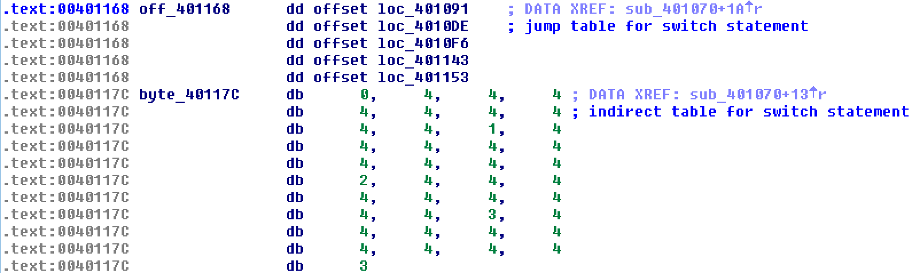
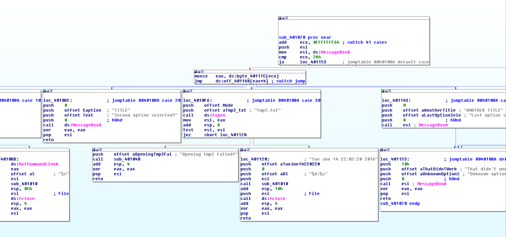
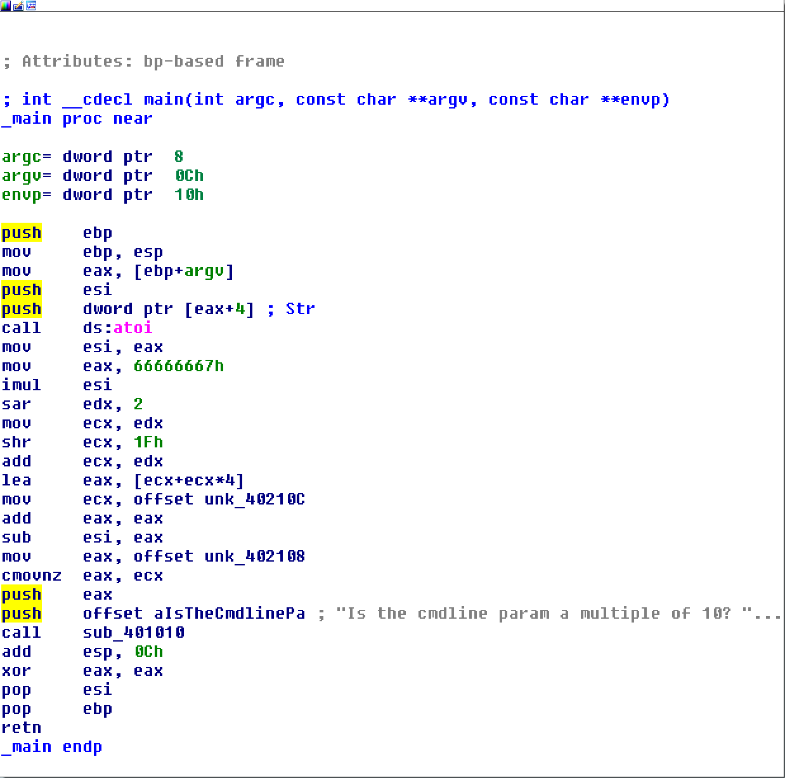

:title: Introduction to Reverse Engineering
:data-transition-duration: 1500
:css: asm.css

An Introduction to Reverse Engineering

----

Loading and Linking
===================

----

Objectives
==========

* Understand, at a high level, the process of loading and running executables
* Understand some of the actions performed by the C Runtime (CRT) during initialization

----

What Happens at Load Time
=========================

* File gets mapped into memory
* (PE) Relocations get fixed up
* Imports get resolved
* Entry point gets called (if applicable)

----

Dynamic Libraries
=================

* Dynamic Link Libraries (DLLs) and Shared Objects (SOs) typically provide shared functionality
	+ glibc (\*nix)
	+ Kernel32/KERNELBASE/ntdll (Windows)
* Dynamic (NOT runtime) linking implies a dependency
* Exported functions from DLLs and SOs generate import table entries

----

Entry Points
============

* Typical exported entry points may not necessarily be called "main"
	+ _start
	+ _DllMainCRTStartup/_mainCRTStartup
* Other methods - such as TLS callbacks (Windows) may also be invoked

----

Import Resolution
=================

* Import table entries are resolved
* Copies of required libs provided to process
* Addresses of loaded functions added to table
* Loading fails if imports cannot be satisfied

----

Some Additional Points
======================

* Often copies of mappings are provided for common libs
	+ Mappings provided as Copy On Write
	+ Reduces overhead of process creation/loading process
* Other steps may be accomplished, depending on platform
* Runtime linking allows dynamic checks to see if imports exist or not, without preventing loading

----

Binary Analysis
===============

----

Objectives
==========

* Discuss and Understand, at a basic level, some strategies for approaching RE
* Understand, at a basic level, some ways of identifying and applying structure to data

----

Looking for Clues
=================

* Imports
* Exports
* Strings

----

Applying Structure to Data
==========================

* Locate data structures in disassembly
* Identify structures, arrays, and constituent data members

----

Structure Identification
========================

.. image:: ./img/yep_its_wood.jpg

----

Structures
==========

* Telltale signs include:
	+ Grabbing a pointer parameter or local variable
	+ Accessing offsets into that variable
	+ Pointer additions/subtractions into a buffer

.. code:: nasm
	
	; Copying a param
	mov edx, [ebp + 8]
	; Loading a value 12 bytes into the buffer
	mov ecx, [edx + 0xC]

----

More Structure Examples
=======================

.. code:: nasm

	mov eax, [ebp + 0x08]
	lea eax, [eax + 0x0c]
	mov edx, [ebp + 0x0c]
	push edx
	push eax
	call _strcpy
	add esp, 0x08

.. code:: c

	struct MyStruct {
		DWORD	firstField;
		DWORD	secondField;
		char	buf[MAX_PATH];
	};

----

Arrays
======

* Same-sized accesses into a buffer might indicate an array
	+ All accesses into the buffer only read or write same sized values
	+ Most structures have some variance in data size
* Other clues might include
	+ Accesses to sequential offsets in a loop
	+ Use of string instructions (e.g., "rep movs\*" or "rep scas\*", etc.)

----

Structures and Arrays
=====================

* Look at how fields are used in other parts of the program
	+ OS-provided function calls with known input params
	+ Other typelib provided function definitions (e.g., static libs)
	+ Make use of xrefs (where possible)
* Annotations are very useful in getting a good feel for control flow

----

Structures and Arrays - Cont'd
==============================

* Applying dynamic analysis can also be useful
* Hardware breakpoints may be especially helpful
	+ If point of allocation can be found, break on read/write can identify what gets copied into the buffer
	+ Various memory printing options (Windbg/gdb) with offsets can also assist with this

----

Finding Allocations
===================

Heap Allocations

* Look for calls to heap allocation methods
	+ malloc/calloc/etc
	+ HeapAlloc
	+ VirtualAlloc 

* Example:

.. code:: nasm

	push 0x30
	call _malloc
	mov dword [eax + 0x08], ecx

----

Finding Allocations
===================

Stack Allocations

.. code:: nasm

	sub esp, 0x30

----

Compilers - Optimizations
=========================

----

Objectives
==========

* Understand and identify a number of optimizations performed by compilers

----

Jump Tables
===========

* Often produced for switch statements
* A table of offsets to jump to based on the result of a comparison
* Used as an optimization to avoid lots of conditional branches and comparisons

----

Jump Tables - Example C
=======================

.. code:: c

		switch (x) {
		case 10:
			if (NULL == (f = fopen("tmp1.txt", "w"))) {
				printf("Allocation failed!\n");
				goto Cleanup;
			}
			fprintf(f, "%s", GetCommandLineA());
			break;
		case 20:
			MessageBoxA(NULL, 
				"Second option selected!", 
				"TITLE", MB_OK);
			break;
		case 30:
			if (NULL == (f = fopen("tmp2.txt", "w"))) {
				printf("Opening tmp2 failed!");
				goto Cleanup;
			}
			fprintf(f, "%d:%s", __COUNTER__, __TIMESTAMP__);
			break;
		case 40:
		case 50:
			MessageBoxA(NULL, "Last option selected!", 
						"ANOTHER TITLE", MB_OK);
		default:
			MessageBoxA(NULL, "Unknown option selected!", 
					"That didn't work!", MB_ICONERROR);
		}

----

:class: flex-image-2

Jump Tables - Example ASM
=========================

----

:data-x: r2500
:class: flex-image-2

Jump Tables - Example ASM (Cont'd)
==================================

----

Function Inlining
=================

* Function code is copied inline each time it is used
* Reduces overhead of function calls at cost of space
	+ Code is copied rather than reused, resulting in bigger binary
	+ No additional overhead for calls

----

Function Inlining - Example C
=============================

.. code:: c

	BOOL __forceinline func1(int x)
	{
		return x % 10 ? FALSE : TRUE;
	}

	// ... 

	int main(int argc, char** argv)
	{

		const char* tmp = func1(atoi(argv[1])) 
								? "Yes" : "No";
		printf("Is the cmdline param a multiple of 10? %s\n",
			tmp);

		return 0;
	}

----

:class: shrink-image

Function Inlining - Example ASM
===============================

----

Frame Pointer Optimization/Omission
===================================

* Tells the compiler not to use the base pointer (EBP/RBP) as normal
* Frees it up to be used as another general purpose register
* Can make debugging more difficult (harder to reason about call stack)

----

Loop Unrolling
==============

* Instructions within loop body are copied for each iteration
* Larger resulting binary size, but without overhead of branching

----

A Tale of Duff's Device
=======================

* Concept code courtesy of Tom Duff, 1983
* Good case study, though likely no longer significantly performant with modern compilers
* Original requirement involved copying 16-bit units from an array to a memory-mapped register
* Naive approach suffered from performance issues
* Thus, unrolling to blocks of 8 yielded significant improvements

----

Duff's Device - Initial
=======================

.. code:: c

	send(to, from, count)
	register short *to, *from;
	register count;
	{
	    register n = count / 8;
    	do {
        	*to = *from++;
	        *to = *from++;
    	    *to = *from++;
        	*to = *from++;
        	*to = *from++;
        	*to = *from++;
        	*to = *from++;
        	*to = *from++;
    	} while (--n > 0);
	}

----

Initial Effort - Issues
=======================

* This approach works - with one small problem
* Always assumes that the copy target is evenly divisble by 8

----

Duff's Device - The Solution
============================

.. code:: c

	send(to, from, count)
	register short *to, *from;
	register count;
	{
	    register n = (count + 7) / 8;
    	switch (count % 8) {
    	case 0: do { *to = *from++;
    	case 7:      *to = *from++;
    	case 6:      *to = *from++;
    	case 5:      *to = *from++;
    	case 4:      *to = *from++;
    	case 3:      *to = *from++;
    	case 2:      *to = *from++;
    	case 1:      *to = *from++;
            	} while (--n > 0);
    	}
	}

