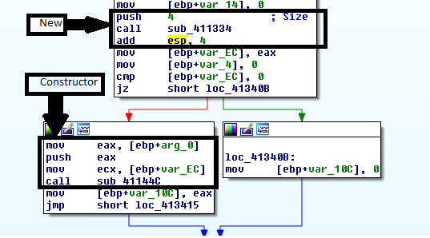
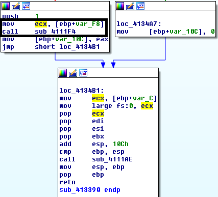

:title: Introduction to Reverse Engineering
:data-transition-duration: 1500
:css: asm.css

An Introduction to Reverse Engineering

----

C++ And You
===========

How C++ Works Under the Hood

----

Objectives
==========

* Understand and Identify Run Time Type Information (RTTI), and its uses
* Understand and Identify C++ Class Layouts in memory
* Understand how Inheritance Affects C++ in-memory structure
* Understand the composition of C++ class memory functions and vtables
* Understand and Identify the effect of C++ Templates on generated code

----

Approaching C++
===============

* Compiler-generated C++ tends to be complex
* Classes and inheritence create complex structures
* Member functions may lack direct calls of any kind

----

Functions in C++
================

* Function implementation in C++ can vary rather widely
	+ Overloading 
	+ Templates
	+ Member Functions and Inheritence
* Also features differences in calling convention and implicit arguments

----

A Note on Name Mangling
=======================

* Name mangling in C++ tends to be much more complex than in C

----

Classes
=======

* C++ Class structure can vary a bit based on composition
* Plain Old Data (POD) types tend to be roughly analagous to C
* Inherited classes and virtual methods can make class composition quite a bit more complex

----

Identifying Classes
===================

* Member functions tend to make heavy use of ECX\*, especially if it does not appear to have been initialized
* The this pointer (passed either via ECX or as the first argument to the function) is a pointer to the top of the current class object.

\* NOTE: this is only true for Microsoft x86 - __thiscall on SYSTEM V and all x86_64 platforms simply pass the this pointer as an implicit first argument

----

Constructors
============

* Constructors may get called in different contexts depending on how the object they back is allocated
* Global objects get initialized during CRT startup (before main)
* If stack allocated, call to ctor will be preceded by sub esp, <sizeof(class)>
* If heap allocated, call to ctor will be preceded by a call to new()
* In all cases, there will be a mov into ECX

----

Constructors (cont'd)
=====================
	
Given this class:

.. code:: c++

	class TestClass {
	private:
		uint32_t inner_;
	public:
		TestClass() : inner_(20) { }
		TestClass(uint32_t t) : inner_(t) {}
		~TestClass() {}

		uint32_t get() const { return inner_; }
		void message(const std::string& val) {
			std::cout <<
				val << std::endl;
		}
	}	

----

Constructors: Dynamic
=====================

.. code:: c++

	TestClass* t = nullptr;

	t = new TestClass(v)

----

Constructors: Stack
===================

.. code:: c++

	void func()
	{
		TestClass t;

		std::cout << "Value from func: " << t.get() 
		          << std::endl;
	}

----

Constructors: Stack
===================

.. image:: ./img/ClassStackAllocation.png

----

Constructors: Global
====================

.. code:: c++
	
	TestClass gTest(40);

	int main(int argc, char** argv)
	{
		std::cout << "Value from global: " << gTest.get() 
		          << std::endl;

		return 0;
	}

.. image:: ./img/ClassGlobalInitialization.png

----

Destructors
===========

* Compiler ensures they get called when an object is destroyed
* In a stack allocated object, the dtor will be called prior to stack frame collapse
* With heap allocated objects, the dtor will be called as part of the delete process, prior to the backing memory getting freed
* The dtor of global objects gets called during process cleanup, after "main" (or equivalent) returns.

----

Destructors (cont'd)
====================

.. code:: c++

	TestClass* t = nullptr;
	t = new TestClass(v);
	// ...
	delete t

----

Member Functions
================

.. code:: c++

	TestClass* t = new TestClass();
	t->get();

* Non-virtual member functions use the __thiscall calling convention (MS x86)
* The "this" pointer, which points to the top of object currently being operated on, is passed via ECX (or as the implicit first argument)

----

Static Methods
==============

.. code:: c++

	TestClass::message("Test");

* Generally, these follow somewhat more standard rules regarding calling convention
* No "this" pointer is passed to static methods

----

Thunks
======

* A small chunk of code that is called by a function, but will not return
* Instead it performs some small action, and jumps to a "real" function
* Target function will return to original calling code
* May be used to fix up calling conventions, implement closures, or, in some cases, manage virtual function selection (among other things)

----

Class Memory Layout
===================

* Classes containing virtual member functions get an extra hidden structure member
* The vfptr (top of structure) points to the class's vtable, which contains pointers to virtual member functions.

----

Class Layout: NormalClass
=========================

.. code:: c++

	class NormalClass {
	private:
		uint32_t a_;
	public:
		NormalClass(uint32_t v) : a_(v) {}
		uint32_t get() const { return a_; }
	}

.. code:: 

	NormalClass -> size(4)
	----------------------
	0x00: | a\_ 

----

Class Layout: NormalClass
=========================

In action:

.. code:: c++
	
	NormalClass n(20);
	std::cout << "Size: " << sizeof(NormalClass) <<
	          "\nFirst element: " << *((uint32_t*)&n)
	          << std::endl;

Output:

.. code:: bash

	Size: 4
	First Element: 20

----

Class Layout: VirtualClass
==========================

.. code:: c++

	class VirtualClass {
	private:
		uint32_t a_;
	public:
		virtual ~VirtualClass() {}
		VirtualClass(uint32_t v) : a_(v) {}
		virtual uint32_t get() const { return a_; }
	};

.. code::
	
	VirtualClass -> size(8)
	-----------------------
	0x00: | (vfptr)
	0x04: | a\_

----

Class Layout: VirtualClass2
===========================

.. code:: c++

	class VirtualClass2 {
	private:
		uint32_t b_;
	public:
		virtual ~VirtualClass2() {}
		VirtualClass2() : b_(20) {}
		virtual void stuff() {}
	}

.. code::

	VirtualClass2 -> size(8)
	------------------------
	0x00: | (vfptr)
	0x04: | b\_

----

Class Layout: InheritedClass
============================

.. code:: c++

	class InheritedClass : 
	                      public VirtualClass, 
	                      public VirtualClass2 
	{
	private:
		uint32_t c_;
	public:
	 	InheritedClass() : c_(10) {}
	 	virtual void stuff() { 
	 		MessageBoxA(nullptr, "Stuff", "Stuff", MB_OK);
	 	}
	}

.. code::

	InheritedClass -> size(20)
	--------------------------
	      | [Base Class VirtualClass]
	0x00: | VirtualClass::(vfptr)
	0x04: | VirtualClass::a\_
	      | [Base Class VirtualClass2]
	0x08: | VirtualClass2::(vfptr)
	0x0c: | VirtualClass2::b\_
	0x10: | c\_

----

Inheritence and Virtual Functions
=================================

----

Pure Virtual Functions and Purecall
===================================

----

Type Information
================

----

Identifying RTTI
================

----

Templates
=========

----

Exceptions
==========

----

Structured Exception Handling (SEH)
===================================

----

C++ Exceptions
==============

----

\*nix Exceptions
================

* Vary a bit by implementation
* Some older implementations relied on setjmp/longjmp
* Newer libs typically take a table-based approach (similar to Microsoft's)

----

References
==========

* OpenRCE Article on Exception Handling and C++ Class composition by Igor Skochinsky - http://www.openrce.org/articles/full_view/21

* A bit dated now, but still somewhat relevent - C++ Under the Hood by Jan Gray - Archived at: http://www.openrce.org/articles/files/jangrayhood.pdf

* The Old New Thing article about member function pointers - https://blogs.msdn.microsoft.com/oldnewthing/20040209-00/?p=40713

* Sabanal/Yason (IBM) Presentation from Blackhat 2007 - Reversing C++ - https://www.blackhat.com/presentations/bh-dc-07/Sabanal_Yason/Paper/bh-dc-07-Sabanal_Yason-WP.pdf

* The C++ Standard - https://isocpp.org/std/the-standard (current); 

----

Additional Topics
=================

As time permits...

----

Objectives
==========

* Rust
* Go
* Crypto Constants
* Anti-debugging techniques
* Forensics?
* ??

----

// EMPTY

----

Review
======
